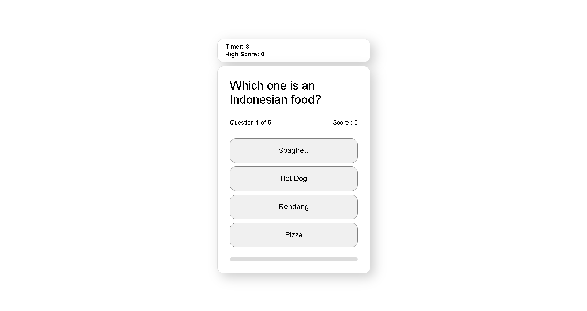

# Simple Mini Quiz App

A simple interactive quiz web based application built with HTML, CSS, and JavaScript.

This project was created to practice front-end development concepts such as DOM manipulation, event handling, timers, and dynamic UI updates.

## Several Features

-  Multiple choice quiz
-  Countdown timer system
-  Score calculation
-  Interactive user interface
-  Automatic question transition
-  Responsive design

## The Technologies That I Used

- HTML5
- CSS3
- JavaScript (Vanilla JS)

## Project Structure 📂

Mini-Quiz/
│
├── index.html
├── style.css
├── script.js
└── README.md

## Preview

## What I Learned by Building this Project

Through this project, I practiced:

Manipulating HTML elements using JavaScript
Working with events and functions
Creating a timer system
Updating UI dynamically
Managing project structure with Git and GitHub

## 👨‍💻 Author 
Abel Alhadilla

GitHub:
https://github.com/Abel-Alhadilla
